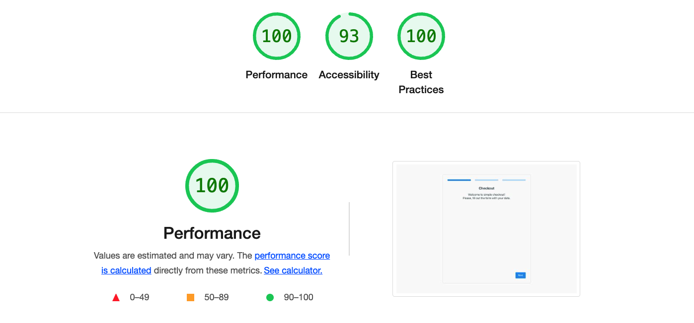

# Github checkout

This project allow checkout and load data from Github.

### Project build and run

```
npm install
npm run build && npm run serve
```
### Project development

```
npm install
npm run dev
```
### Run Unit Tests

```
npm run test
```
### Project structure
```
.
├── src
│   ├── App.vue
│   ├── assets
│   │   └── base.scss
│   ├── components
│   │   ├── ButtonPrimary.vue
│   │   ├── FinalInfo.vue
│   │   ├── InputCheckbox.vue
│   │   ├── InputText.vue
│   │   ├── StepsIndicator.vue
│   │   └── icons
│   │       └── IconCheck.vue
│   ├── constants
│   │   └── fields.ts
│   ├── helpers
│   │   └── validation.ts
│   ├── main.ts
│   ├── router
│   │   └── index.ts
│   ├── services
│   │   └── GitHubService.ts
│   ├── types
│   │   ├── interfaces.ts
│   │   └── types.ts
│   └── views
│       └── FormView.vue
├── tests
│   ├── integration
│   │   └── views
│   │       └── FormView.spec.ts
│   ├── jest-setup.ts
│   ├── unit
│   │   ├── components
│   │   │   ├── ButtonPrimary.spec.ts
│   │   │   ├── FinalInfo.spec.ts
│   │   │   ├── InputCheckbox.spec.ts
│   │   │   ├── InputText.spec.ts
│   │   │   ├── StepsIndicator.spec.ts
│   │   │   └── __snapshots__
│   │   │       ...
│   │   └── helpers
│   │       └── validation.spec.ts
│   └── utils
│       └── __mocks__.ts
...
```
### Gotchas
- Usually, I use state management (Vuex / Pinia), but on this project decided not to put additional packages because it is only one form. But if the project will grow, it needs state management.
- In further steps of the development project needs e2e tests. I did not write them in this assignment because the integration tests did their job for such a short user flow. But in further extends of functionality, I would add the e2e test on Cypress.
- I did custom form validation, but it would be less verbose to use some validation-helper package in the bigger project.

### Technologies used
- Vue3
- jest for unit tests
- testing-library for integration tests
- sass
- typescript

### Performance of the built project


